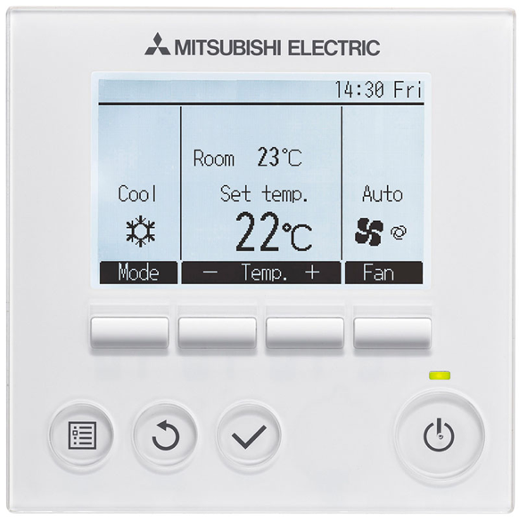
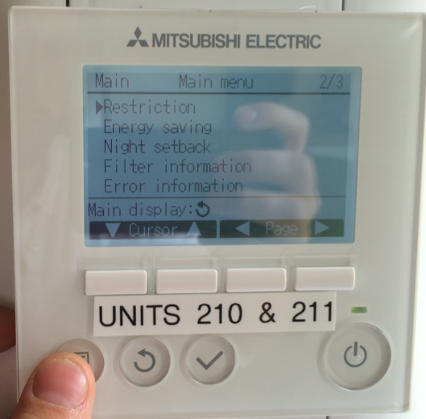
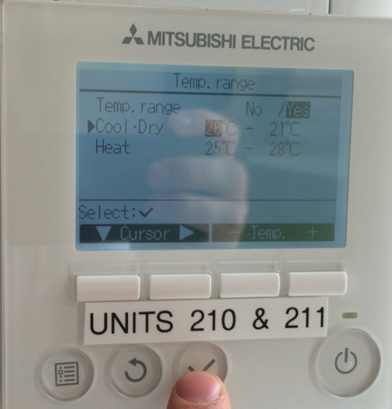
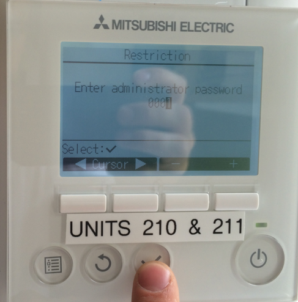
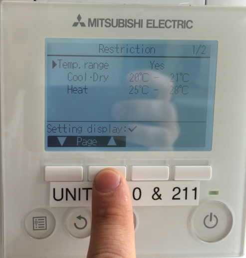

#Mitsubishi Electric PAR-31MAA

#Air conditioning unit management system: official instructions for use

 
##Introduction

Congratulations. You are about to begin pressing buttons on a Mitsubushi Electric PAR-31MAA air conditioning unit management system. This is one of the finest air conditioning unit management systems in the world, designed by a hand-picked selection of the best Japanese air conditioning unit management systems designers in the world. Few people are lucky enough to have this experience in their lifetimes, so please display appropriate humility in conversation with your friends and colleagues. 

In your meddling with this sophisticated piece of machinery, you will naturally be asked for an administrators’ password many times. This password is: “0001”. Handle it with care. Much ill could occur if this were to fall into the wrong hands.

Mastery of one’s ambient temperature is not for the faint-hearted, or those without the appropriate administrative authority. Before you think about changing the temperature or fan-speed within a room, you must really get to the heart of the issue at hand: do I really want this to happen? The journey towards change may be long and arduous, and involve more than one illogical sub-menu. 

Let’s assume that you want something to happen now, related to the air conditioning (this is a fairly safe assumption, since you are reading this manual). You will want to turn the air conditioning on, or off. You might wish to make the fan less or more intese, or change the angle – or even have a constantly changing angle – of the airflow. In an extreme circumstance, you might want to change the temperature in the room. 

Over time, the inherent complexity of achieving even the simplest task will fill you with a sense of achievement and pride.

##Operations

1. **On and off**
The presumptuous user might wish to occasionally switch the unit on or off. This is one of the rare operations not requiring a password. Use the ‘on/off’ button.

2. **Fan speed**
Do not be fooled by the ease of the previous operation! Fan speed requires marginally more thought, as it should. Press the ‘Fan’ button. The graphic interface will serve to illustrate what wonders the machine is working in terms of fan speed.

3. **Temperature**
If you wish to change the temperature, first ask yourself, ‘What is wrong with the current temperature?’ If the answer is not a great deal, then do not make any changes. It just is not worth your time or effort.  
The second question one must ask is whether one has the administrative authority to make such a decision. This is not something to be taken lightly. If in doubt, send an email to your central administrative body, who may have decided on the correct temperature for rooms months in advance.  
Of course, there is no ‘make it hotter’ button! Only a fool would desire such a thing. Part of the joy of the Mitsubushi Electric PAR-31MAA air conditioning unit management system is that it forces the user to think like the owner of a Mitsubushi Electric PAR-31MAA air conditioning unit management system. We cannot select the temperature we wish for directly. Rather, we will give the machine parameters – a range – within which to operate. 
	- Press the menu button. Scroll to ‘Restriction’.

	- Press the tick button.

	- Press the tick button again.
	- Enter the administrator password (0001).

	- Then scroll and set the temperature range. For example, 21-23ºC. Set both Cool•Dry and Heat to the same temperature ranges, as there is no real logic to which mode the machine works within.  

Pro tip: a smaller temperature range, with only a couple of degrees, is almost like setting the temperature itself.  
Once you are finished, press the tick button a few times. Then press the round ‘back’ arrow button a few times. With any luck, you will see a temperature displayed on the screen which is within your parameters.

4. **Vent angles**
This is for advanced users only. Sometimes – in very rare circumstances – you may wish to change the fan angle. An example might be if the fan’s current angle is endangering your life, or blowing needlessly cold air down the back of your neck.  
	- Press the menu button.
	- Go to ‘Vane•Louver•Vent (Loussnay)’.
Here you can set the angle. The graphic interface clearly shows the angles possible. The ‘swing’ function is a powerful tool for theblowing of air at all angles within the fan’s operable range.

The fool might try multiple angles to see which works the best for him. Do not be tempted by such frivolous behaviour. Just because there is no administrative password associated with this operation, does not make it a light affair, or one devoid of responsibility. The wise man chooses his angle in advance, so that time might not be wasted, and air conditioning management machines not damaged, by such trivialities.

